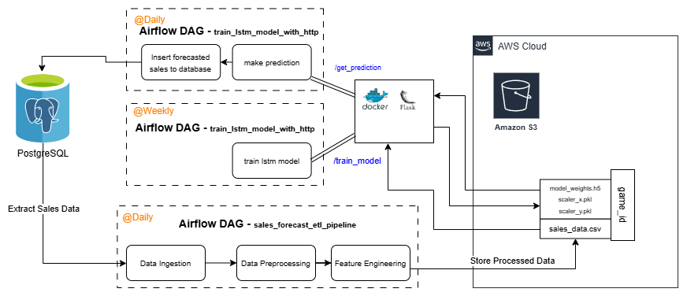

# kratos-digital-store

Kratos Digital Store is an e-commerce platform for games, designed to manage and distribute digital game products efficiently. The system is built with a modern tech stack, leveraging React for the frontend and PostgreSQL for data management. The backend uses Sequelize ORM in Node.js server to manage database interactions, with Redux Toolkit for state management and Redux Saga for handling asynchronous operations like user authentication.

### Key features include:

📈Personalized Sales Forecasting: Incorporates LSTM models for dynamic sales prediction.
🖥️Sales Data Management: Captures and processes sales data using an ETL pipeline.
🎮Product Catalog: Organized by categories and game genres.
🗿Backend & Deployment: The system is hosted on AWS, with the frontend deployed via Vercel for fast and scalable distribution.

# Sales Forecast ETL Pipeline (Airflow DAG)

## Overview
This Airflow DAG automates the process of extracting, transforming, and uploading game sales data to S3 for sales forecasting.

## Workflow Steps
1. **Extract Sales Data**  
   - Fetches sales data from the PostgreSQL database.  
   - Stores the extracted data in a staging table (`staging_sales_data`).  

2. **Fetch Game IDs**  
   - Retrieves a list of `game_id`s from the `Games` table.  

3. **Transform and Upload Sales Data**  
   - Fetches sales data for each game from the staging table.  
   - Performs feature engineering:  
     - Converts `genres` into one-hot encoded format.  
     - Encodes game reviews into numerical values.  
     - Computes additional features like `days_since_release` and `launch_boost`.  
   - Aggregates data into a time-series format.  
   - Saves the transformed data as a CSV file.  
   - Uploads the processed CSV to an S3 bucket (`kp-artifacts-data/kratos/sales_data/`).  

4. **Cleanup Staging Table**  
   - Drops the `staging_sales_data` table after successful execution.  

## Dependencies
- **AWS S3**: Stores transformed sales data.  
- **PostgreSQL**: Source of raw sales data.  
- **Airflow Tasks**: Implemented using `@task()` decorators for modular execution.  

## DAG Flow

# Current pipeline

Working on creating pipeline for automatic training of ml models and forecasting
