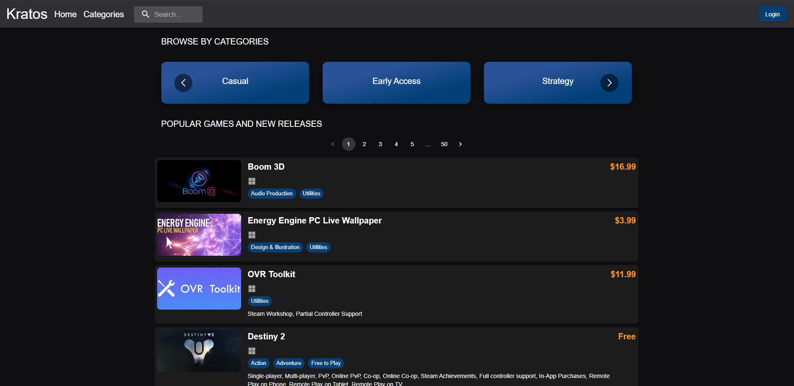
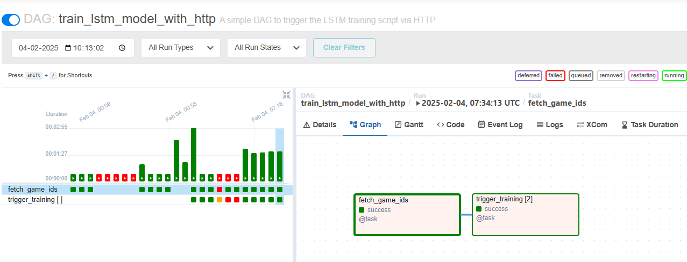
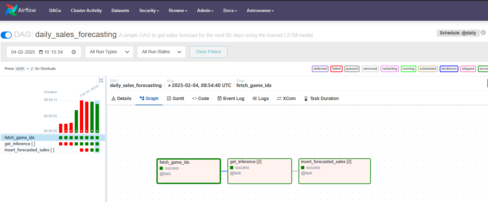

# kratos-digital-store

  
  

Kratos Digital Store is an e-commerce platform for games, designed to manage and distribute digital game products efficiently. The system is built with a modern tech stack, leveraging React for the frontend and PostgreSQL for data management. The backend uses Sequelize ORM in Node.js server to manage database interactions, with Redux Toolkit for state management and Redux Saga for handling asynchronous operations like user authentication.

### Key features include:

- 📈Personalized Sales Forecasting: Incorporates LSTM models for dynamic sales prediction.
- 🖥️Sales Data Management: Captures and processes sales data using an ETL pipeline.
- 🎮Product Catalog: Categorized by genre and type and efficiently fetched using pagination for better performance.
- 🗿Backend & Deployment: The API services were deployed to Google Cloud Platform using Terraform (Infrastructure as Code), with GitHub Actions powering the CI/CD pipeline. The client-side react app was deployed through vercel.

# Backend CI/CD using Github actions + Deployment using Terraform

  
  

# Current Pipeline

# Sales Forecast

Sample predictionon one of the game

# Airflow DAG

## 1. Sales Forecast ETL Pipeline

### Overview

This Airflow DAG automates the process of extracting, transforming, and uploading game sales data to S3 for sales forecasting.

### Workflow Steps
1. **Extract Sales Data**  
   - Fetches sales data from the PostgreSQL database.  
   - Stores the extracted data in a staging table (`staging_sales_data`).  

2. **Fetch Game IDs**  
   - Retrieves a list of `game_id`s from the `Games` table.  

3. **Transform and Upload Sales Data**  
   - Fetches sales data for each game from the staging table.  
   - Perform feature engineering:  
     - Converts `genres` into one-hot encoded format.  
     - Encodes game reviews into numerical values.  
     - Computes additional features like `days_since_release` and `launch_boost`.  
   - Aggregates data into a time-series format.  
   - Saves the transformed data as a CSV file.  
   - Uploads the processed CSV to an S3 bucket (`kp-artifacts-data/kratos/sales_data/`).  

4. **Cleanup Staging Table**  
   - Drops the `staging_sales_data` table after successful execution.  

### DAG Flow

## 2. Train LSTM Model Pipeline

### Overview

This Airflow DAG automates the process of training lstm model and storing the weights

### Workflow steps
1. **Fetch Game IDs**
   - Retrieves a list of `game_id`s from the `Games` table.  
2. **Train LSTM Model**
   - Fetch processed `sales_data.csv` from S3 bucket
   - Create sequences from the training data for LSTM model
   - Apply `MinMaxScaler` to the features
   - Train the LSTM model
   - Upload weights (`model_weights.h5`) and scalers to S3 bucket

### DAG Flow

## 3. Daily Sales Forecasting Pipeline

### Overview

This Airflow DAG automates the process of getting sales forecast from the trained lstm model

### Workflow steps
1. **Fetch Game IDs**
   - Retrieves a list of `game_id`s from the `Games` table.  
2. **Getting sales forecast**
   - Fetch the stored model weights and scalers from S3 bucket
   - Create sequences from the last 20 days
   - Get prediction from the mode lfor the next 60 days
3. **Store the forecasted sales**
   - Delete previously forecasted sales from `forecasted_sales` table
   - Insert the newly forecasted sales

### DAG Flow

# Docker
Dockerizing a flask app that contains scripts for training and testing LSTM model
